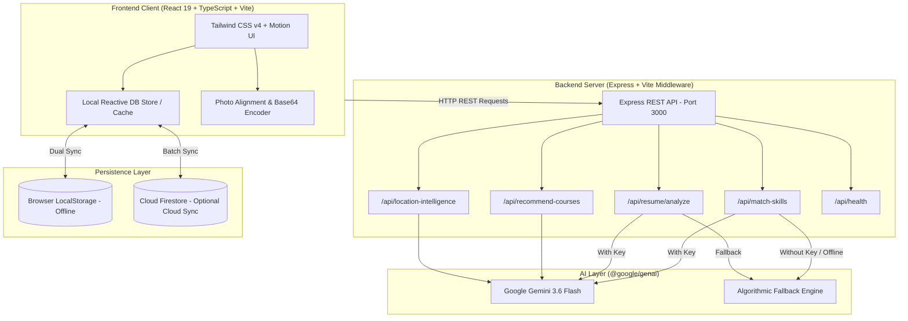

<div align="center">

# 🌉 AI Skill Bridge
### Intelligent Location-Based Skill Ecosystem & Opportunity Matching Platform

[](https://react.dev/)
[](https://www.typescriptlang.org/)
[](https://vitejs.dev/)
[](https://tailwindcss.com/)
[](https://ai.google.dev/)
[](https://firebase.google.com/)
[](https://nodejs.org/)
[](LICENSE)

<p align="center">
  <b>Bridging the gap between talent, enterprise requirements, and educational pathways through Generative AI, automated resume parsing, real-time skill-gap diagnosis, and location-driven hiring intelligence.</b>
</p>

[Explore Features](#-key-features) • [System Architecture](#-system-architecture) • [Quick Start](#-quick-start-guide) • [Demo Credentials](#-demo-accounts--credentials) • [API Reference](#-api-documentation) • [Troubleshooting](#-troubleshooting--faq)

---

</div>

## 📌 Executive Summary

Modern recruitment often fails regional and emerging talent due to rigid keyword matching, lack of transparent skill feedback, and fragmented geographical hiring data. Candidates receive silent rejections without actionable advice, while companies struggle to source candidates equipped with exact technology stacks.

**AI Skill Bridge** resolves this through an integrated, AI-first ecosystem connecting five primary stakeholder personas: **Students**, **Unemployed Candidates**, **Employed Professionals**, **Hiring Companies**, and **Ecosystem Administrators**.

### What Makes AI Skill Bridge Unique?
1. **Explainable AI Matching**: Replaces arbitrary scoring with clear match percentages, identified strengths, critical missing skills, and tailored recovery paths.
2. **Automated Gap Remediation**: Missing skills link directly to curated micro-courses; completing a course dynamically recalculates candidate match scores across past applications in real-time.
3. **AI Multimodal Resume Parsing**: Candidates drag and drop PDF or image resumes; Gemini extracts contact details, education, work experience, and structured skill tags automatically.
4. **Regional Labor Intelligence**: Deep real-time analytics for major hubs (Hyderabad, Visakhapatnam, Kakinada, Rajahmundry, Vijayawada, Guntur) showing skill demand distribution and active employers.
5. **Dual Database Architecture (Offline-First)**: Runs out of the box with zero external setup using local storage + built-in fallback heuristics, while seamlessly supporting live two-way synchronization with **Google Cloud Firestore**.

---

## 🎯 Multi-Role Ecosystem

AI Skill Bridge provides dedicated interfaces tailored to each stakeholder:

```
┌────────────────────────────────────────────────────────────────────────┐
│                        AI SKILL BRIDGE PLATFORM                        │
└───────────────────────────────────┬────────────────────────────────────┘
                                    │
    ┌───────────────────────────────┼──────────────────────────────┐
    ▼                               ▼                              ▼
┌──────────────┐             ┌──────────────┐             ┌──────────────┐
│  CANDIDATES  │             │  COMPANIES   │             │ADMINISTRATORS│
├──────────────┤             ├──────────────┤             ├──────────────┤
│ • Students   │             │ • Post Roles │             │ • Project    │
│ • Unemployed │             │ • Review AI  │             │   Approval   │
│ • Employees  │             │   Rankings   │             │ • User/Firm  │
│ • Gap Audit  │             │ • Accept or  │             │   Governance │
│ • Upskilling │             │   Reject     │             │ • Regional   │
│ • Resume AI  │             │ • Feedback   │             │   Analytics  │
└──────────────┘             └──────────────┘             └──────────────┘
```

| Stakeholder Role | Primary Capabilities | Value Delivered |
| :--- | :--- | :--- |
| **🎓 Student** | Search internships, upload resume for instant AI parsing, view required competencies, complete recommended courses | Seamless transition from academic theory to industry-ready skills with guided pathways. |
| **💼 Unemployed Candidate** | Apply to commercial projects, view diagnostic skill gap reports, discover high-demand local tech stacks | Constructive rejection feedback with actionable learning roadmaps instead of ghosting. |
| **🚀 Employee** | Explore lateral career pivots, benchmark existing capabilities against new industry trends, upskill | Lifelong career mobility and verified competency progression. |
| **🏢 Company / Recruiter** | Create project/internship listings, inspect candidates ranked by AI Match Score, issue approvals/rejections | Drastically lower screening time by leveraging objective, transparent candidate matching. |
| **🛡️ Ecosystem Admin** | Approve/reject project postings before public broadcast, audit registered users and companies, review analytics | Safeguards platform quality and maintains trust across the regional talent market. |

---

## 🚀 Key Features

### 1. 🤖 Gemini-Powered Skill Matching Engine (`/api/match-skills`)
- Uses **Gemini 3.6 Flash** with structured JSON output schemas (`responseSchema`).
- Performs semantic comparison between candidate capabilities and project requirements.
- Returns:
  - **Match Percentage** (0–100%)
  - **Matching Skills** (mutual overlap)
  - **Missing Skills** (gap delta)
  - **Identified Strengths & Weaknesses**
  - **Estimated Learning Time** (e.g., `15 Days`, `30 Days`)
  - **3-Step Structured Learning Roadmap**
  - **Suggested Certification Title**
  - **Expected Match Score After Upskilling** (e.g., 95%)

### 2. 📄 Multimodal Resume Parsing (`/api/resume/analyze`)
- Ingests base64-encoded PDF or image files.
- Extracts candidate name, email, mobile phone, highest degree, career summary, and a normalized array of skill tags.
- Pre-populates registration and profile-edit forms with one click.
- Automatic avatar alignment adjustments (top/center/bottom/fit) for professional presentation.

### 3. 📚 Dynamic Course Enrollment & Skill Boost
- Recommends targeted bootcamps for detected missing skills via `/api/recommend-courses`.
- Interactive course completion simulation:
  - Awards a verified Certificate of Completion.
  - Automatically appends acquired competencies to the user's permanent profile.
  - **Dynamic Retrospective Score Boost**: Automatically updates and increases match scores across all existing project applications.

### 4. 📍 Regional Location Intelligence (`/api/location-intelligence`)
- Covers tier-1 and tier-2 technological hubs:
  - **Hyderabad** (Enterprise, Cloud, Full Stack, Generative AI)
  - **Visakhapatnam** (Smart Ports, Logistics, Maritime Soft, Cybersecurity)
  - **Kakinada** (IoT Telemetry, AgriTech, Firmware)
  - **Rajahmundry** (Digital Commerce, Mobile Flutter, Industrial Automation)
  - **Vijayawada** (ERP Architecture, Web Portals, Android Development)
  - **Guntur** (Cloud DevOps, Kubernetes, Enterprise Microservices)
- Visualizes top hiring companies, in-demand skills, candidate volume, and percentage distribution.

### 5. 🛡️ Administrative Moderation & Governance
- Multi-step approval pipeline: company project postings remain pending until reviewed and approved by an administrator.
- Real-time automated system notifications dispatched upon approval, rejection, or course completion.
- One-click ecosystem governance for users and corporate listings.

### 6. ⚡ Resilient Hybrid Storage & Offline Fallback
- **Zero-Config Offline Mode**: If `GEMINI_API_KEY` is not provided, the platform automatically switches to built-in algorithmic string-distance matching and curated local curricula.
- **Firebase Firestore Integration**: Automatically detects Firebase credentials and provisions two-way synchronization with Firestore using batched writes.

---

## 🏗️ System Architecture



---

## 💻 Technology Stack

| Layer | Technology | Version | Purpose |
| :--- | :--- | :--- | :--- |
| **Frontend Framework** | [React](https://react.dev/) | `19.0.1` | Next-generation declarative component architecture |
| **Language** | [TypeScript](https://www.typescriptlang.org/) | `5.8.2` | Strict end-to-end type safety across client and server |
| **Bundler & Dev Server** | [Vite](https://vitejs.dev/) | `6.2.3` | Lightning-fast HMR and optimized production bundling |
| **Styling** | [Tailwind CSS](https://tailwindcss.com/) | `4.1.14` | Modern utility-first stylesheet engine |
| **Animations** | [Motion](https://motion.dev/) | `12.23.24` | Fluid UI transitions, modal animations, and micro-interactions |
| **Icons** | [Lucide React](https://lucide.dev/) | `0.546.0` | Clean, accessible vector UI icons |
| **Backend Framework** | [Express](https://expressjs.com/) | `4.21.2` | High-performance HTTP server handling API endpoints and static assets |
| **Runtime Execution** | [TSX](https://github.com/privatenumber/tsx) | `4.21.0` | Direct execution of TypeScript server files without manual transpilation |
| **Artificial Intelligence** | [@google/genai](https://www.npmjs.com/package/@google/genai) | `2.4.0` | Official Google GenAI SDK for Gemini 3.6 Flash integration |
| **Database (Cloud)** | [Firebase SDK](https://firebase.google.com/) | `12.16.0` | Cloud Firestore real-time synchronization and storage |
| **Bundler (Server)** | [esbuild](https://esbuild.github.io/) | `0.25.0` | High-speed server bundling for production artifacts |

---

## 📁 Repository Structure

```
ai-skill-bridge/
├── .env.example               # Template for environment variables
├── .gitignore                 # Excluded directories and sensitive files
├── assets/                    # Project imagery and branding assets
├── HOW_TO_RUN.txt             # Quick terminal run cheatsheet
├── README.md                  # Comprehensive documentation (this file)
├── index.html                 # HTML5 entry shell
├── package.json               # NPM scripts, dependencies, and metadata
├── tsconfig.json              # TypeScript compilation configuration
├── vite.config.ts             # Vite configuration with React & Tailwind plugins
├── firestore.rules            # Firebase security rules specification
├── firebase-blueprint.json    # Firestore schema & entity definitions
├── server.ts                  # Express API server + Vite middleware + Gemini integration
└── src/
    ├── main.tsx               # React application mounting point
    ├── App.tsx                # Main router, notification hub, layout coordinator
    ├── index.css              # Global styles, Tailwind imports, custom animations
    ├── types.ts               # Core TypeScript interface definitions
    ├── components/
    │   ├── AdminPanel.tsx     # Administrative moderation and analytics dashboard
    │   ├── Auth.tsx           # Multi-role authentication, sign-up, and resume ingest
    │   ├── CandidateDashboard.tsx # Student/Candidate workspace, applications & courses
    │   ├── CompanyDashboard.tsx   # Recruiter portal, project posting & evaluation
    │   ├── LocationStats.tsx      # Regional labor market intelligence analytics
    │   └── Splash.tsx         # Welcome splash screen with quick-start actions
    └── lib/
        ├── db.ts              # Reactive database engine, seed records & matching logic
        ├── firebase.ts        # Firebase Firestore connection and synchronization utilities
        └── photoUtils.ts      # Profile picture positioning and crop framing helpers
```

---

## ⚡ Quick Start Guide

Follow these step-by-step instructions to get the application running on your local machine.

### Prerequisites

Ensure you have the following installed:
- **Node.js**: Version `18.x`, `20.x` (LTS), or `24.x` (LTS)
- **npm**: Version `9.x` or higher (bundled with Node.js)

Verify your installation:
```bash
node -v
npm -v
```

> **Windows Users**: If Node.js is not yet installed, you can install it via PowerShell:
> ```powershell
> winget install OpenJS.NodeJS.LTS
> ```

---

### Step 1: Clone or Open the Project

Navigate to the directory containing the project:
```bash
cd c:\Users\Joshna\Downloads\ai-skill-bridge
```

---

### Step 2: Configure Environment Variables

Create your `.env` configuration file by copying `.env.example`:

**Windows PowerShell:**
```powershell
Copy-Item .env.example .env
```

**macOS / Linux / Git Bash:**
```bash
cp .env.example .env
```

Open `.env` in your text editor and configure the variables:

```ini
# Port for the web server (default: 3000)
PORT=3000

# Environment mode (development | production)
NODE_ENV=development

# Google Gemini API Key (Optional but recommended)
# Get a free key at: https://aistudio.google.com/app/apikey
GEMINI_API_KEY="your_actual_gemini_api_key_here"

# (Optional) Firebase Cloud Firestore configuration
# If omitted, the app runs entirely in local offline mode
VITE_FIREBASE_API_KEY=""
VITE_FIREBASE_AUTH_DOMAIN=""
VITE_FIREBASE_PROJECT_ID=""
VITE_FIREBASE_STORAGE_BUCKET=""
VITE_FIREBASE_MESSAGING_SENDER_ID=""
VITE_FIREBASE_APP_ID=""
```

> [!TIP]
> **No API Key? No Problem!**
> If `GEMINI_API_KEY` is left blank, the server automatically activates the **built-in algorithmic matching engine** and fallback resume parser. You can explore all features immediately without entering credentials.

---

### Step 3: Install Dependencies

Install the project dependencies using npm:

```bash
npm install
```

> [!NOTE]
> **Windows Script Execution Note:**
> If PowerShell blocks npm scripts with an execution policy error, run:
> ```powershell
> Set-ExecutionPolicy -Scope CurrentUser -ExecutionPolicy RemoteSigned
> ```
> Or invoke npm via `npm.cmd`:
> ```powershell
> npm.cmd install
> ```

---

### Step 4: Run the Application (Development Mode)

Start the full-stack development server with hot-module reloading:

```bash
npm run dev
```

You should see output similar to:
```
  🚀 AI Skill Bridge is running!
  ➜  Local:   http://localhost:3000/
  ➜  Network: http://127.0.0.1:3000/
```

Open your web browser and navigate to:
👉 **[http://localhost:3000](http://localhost:3000)**

---

### Step 5: Verify System Health

You can verify that the backend and AI integration are operational by querying the health check endpoint:

**In your browser:**
[http://localhost:3000/api/health](http://localhost:3000/api/health)

**Or via PowerShell:**
```powershell
Invoke-RestMethod -Uri "http://localhost:3000/api/health"
```

**Expected JSON response:**
```json
{
  "status": "ok",
  "timestamp": "2026-09-09T05:52:00.000Z",
  "aiEnabled": true
}
```

---

## 👥 Demo Accounts & Credentials

The system includes pre-seeded accounts representing every role in the ecosystem. You can sign in immediately using any of the following credentials (enter any password, e.g., `password123`):

| Role | Name | Email | Location | Primary Skills / Focus |
| :--- | :--- | :--- | :--- | :--- |
| **🛡️ System Admin** | System Admin | `admin@skillbridge.org` | Hyderabad | Platform governance, project approval, user management |
| **🏢 Company Recruiter** | Ramesh Kumar | `hr@astra.io` | Hyderabad | Astra AI Labs — Posting roles, reviewing candidates |
| **🎓 Student** | Arjun Prasad | `arjun@gmail.com` | Kakinada | Python, C++, Communication (JNTU Kakinada) |
| **🎓 Student** | Kiran Dev | `kiran@gmail.com` | Rajahmundry | PHP Laravel, Mobile Flutter, Digital Marketing |
| **🎓 Student** | Ravi Kumar | `ravi@gmail.com` | Vijayawada | PHP Laravel, MySQL, Android Development |
| **💼 Unemployed Candidate** | Lakshmi Reddy | `lakshmi@gmail.com` | Visakhapatnam | React, TypeScript, HTML/CSS/JS (Andhra University) |
| **💼 Unemployed Candidate** | Sita Nair | `sita@gmail.com` | Rajahmundry | E-Commerce, Digital Marketing |
| **💼 Unemployed Candidate** | Nitin Rao | `nitin@gmail.com` | Guntur | Python Django, Docker & Kubernetes |
| **🚀 Employed Professional** | Teja Sri Velugula | `teja@gmail.com` | Hyderabad | React, Python, Cloud Computing, SQL (Tech Global) |
| **🚀 Employed Professional** | Pallavi Joshi | `pallavi@gmail.com` | Vijayawada | PHP Laravel, Angular, MySQL (Apex Solutions) |
| **🚀 Employed Professional** | Deepa Nair | `deepa@gmail.com` | Guntur | React, Cloud DevOps, Python Django (Amaravati Labs) |

> [!TIP]
> **Recommended First Walkthrough:**
> 1. Sign in as **Ramesh Kumar** (`hr@astra.io`) and post a new project or internship.
> 2. Log out and sign in as **System Admin** (`admin@skillbridge.org`) to approve the new posting in the Admin Panel.
> 3. Log out and sign in as **Lakshmi Reddy** (`lakshmi@gmail.com`) to apply for the project and inspect the live **AI Skill Gap Report**.
> 4. Enroll in the recommended bootcamp under the **Learning Hub** to observe your **AI Match Score boost in real-time**!

---

## 📡 API Documentation

All endpoints accept and return JSON. The API runs on the same port as the client.

### 1. `GET /api/health`
Checks server vitality and verifies whether the Gemini API key is configured.

**Response:**
```json
{
  "status": "ok",
  "timestamp": "2026-09-09T05:52:00.000Z",
  "aiEnabled": true
}
```

---

### 2. `POST /api/match-skills`
Computes deep semantic skill matching between candidate competencies and job requirements.

**Request Body:**
```json
{
  "candidateSkills": ["React", "TypeScript", "HTML"],
  "requiredSkills": ["React", "TypeScript", "Cybersecurity", "Tailwind CSS"],
  "projectTitle": "React Security Engineer",
  "projectDescription": "Develop secure seaport frontend portals."
}
```

**Response (Sample):**
```json
{
  "success": true,
  "analysis": {
    "matchPercentage": 75,
    "matchingSkills": ["React", "TypeScript"],
    "missingSkills": ["Cybersecurity", "Tailwind CSS"],
    "strengths": [
      "Demonstrated proficiency in TypeScript and React component lifecycles",
      "Strong frontend foundations"
    ],
    "weaknesses": [
      "Lacks applied cybersecurity authentication and role-based access patterns",
      "Tailwind styling workflow requires practice"
    ],
    "rejectionReason": "",
    "estimatedLearningTime": "15 Days",
    "recommendedLearningPath": [
      "1. Study OWASP Top 10 client vulnerabilities",
      "2. Implement Tailwind CSS utility patterns in existing projects",
      "3. Construct an authenticated sample portal with token refresh"
    ],
    "suggestedCertification": "Certified Web Application Security Associate",
    "expectedMatchAfterCourse": 95
  }
}
```

---

### 3. `POST /api/recommend-courses`
Generates customized educational bootcamps to bridge identified skill deltas.

**Request Body:**
```json
{
  "missingSkills": ["Cybersecurity", "FastAPI"]
}
```

**Response (Sample):**
```json
{
  "success": true,
  "courses": [
    {
      "name": "Hands-on Cybersecurity for Web Developers",
      "description": "Master defense-in-depth, sanitization, and secure JWT handling.",
      "skills": ["Cybersecurity"],
      "duration": "14 Hours",
      "difficulty": "Intermediate",
      "certificate": true,
      "outcome": "Able to audit client-side applications for security weaknesses."
    }
  ]
}
```

---

### 4. `POST /api/resume/analyze`
Extracts structured candidate data from uploaded PDF or image files.

**Request Body:**
```json
{
  "fileData": "data:application/pdf;base64,JVBERi0xLjQK...",
  "mimeType": "application/pdf",
  "fileName": "Candidate_Resume.pdf"
}
```

**Response (Sample):**
```json
{
  "success": true,
  "analysis": {
    "fullName": "Arjun Prasad",
    "email": "arjun@gmail.com",
    "mobileNumber": "9876543210",
    "education": "B.Tech Computer Science, JNTU Kakinada",
    "skills": ["Python", "FastAPI", "Machine Learning", "SQL"],
    "experience": "Academic project lead for sensor telemetry portal"
  }
}
```

---

### 5. `POST /api/location-intelligence`
Returns macroeconomic labor trends, hiring firms, and candidate distribution for a target city.

**Request Body:**
```json
{
  "location": "Visakhapatnam"
}
```

**Response (Sample):**
```json
{
  "success": true,
  "intelligence": {
    "locationName": "Visakhapatnam",
    "topHiringCompanies": ["Symbiosis Tech", "Fluentgrid", "Conduent", "Wipro Vizag"],
    "mostDemandedSkills": ["Web Development", "Data Science", "Cybersecurity", "Embedded Systems"],
    "candidatesCount": 680,
    "availableProjectsCount": 35,
    "topCategories": ["Smart Cities Infrastructure", "Web Applications", "E-Commerce Integrations"],
    "skillDistribution": [
      { "skill": "React", "percentage": 40 },
      { "skill": "Data Science", "percentage": 25 },
      { "skill": "Cybersecurity", "percentage": 18 },
      { "skill": "Embedded Systems", "percentage": 17 }
    ]
  }
}
```

---

## 🛠️ Production Build & Verification

### Static Type Check (Linting)
Run TypeScript compiler in verification mode (`tsc --noEmit`):
```bash
npm run lint
```
*Expected: Clean exit with code 0 (zero errors).*

### Production Bundle
Build both the Vite client application and the bundled Express server (`dist/server.cjs`):
```bash
npm run build
```

### Run Production Server
Launch the compiled production bundle:
```bash
npm run start
```

---

## ☁️ Firebase Firestore Setup (Optional)

The application operates seamlessly in offline mode with local storage persistence. If you wish to connect your own **Google Cloud Firestore** instance for cross-device synchronization:

1. Visit the [Firebase Console](https://console.firebase.google.com/) and create a new project.
2. In the project dashboard, navigate to **Build > Firestore Database** and click **Create database**.
3. Choose **Start in test mode** (or deploy the security rules provided in [firestore.rules](file:///c:/Users/Joshna/Downloads/ai-skill-bridge/firestore.rules)).
4. Add a Web App in Project Settings to acquire your configuration parameters.
5. Add the keys to your `.env` file:
   ```ini
   VITE_FIREBASE_API_KEY="AIzaSy..."
   VITE_FIREBASE_AUTH_DOMAIN="your-app.firebaseapp.com"
   VITE_FIREBASE_PROJECT_ID="your-app"
   VITE_FIREBASE_STORAGE_BUCKET="your-app.appspot.com"
   VITE_FIREBASE_MESSAGING_SENDER_ID="123456789"
   VITE_FIREBASE_APP_ID="1:123456789:web:abcdef"
   ```
6. Restart the server (`npm run dev`). Look for the confirmation log in your terminal:
   ```
   🔥 Firebase Firestore connected successfully!
   ```

---

## ❓ Troubleshooting & FAQ

<details>
<summary><b>Q1: Port 3000 is already in use (EADDRINUSE).</b></summary>

**Solution:** Update the port in your `.env` file:
```ini
PORT=3001
```
Then restart the development server and access `http://localhost:3001`.
</details>

<details>
<summary><b>Q2: 'node' or 'npm' is not recognized as an internal or external command.</b></summary>

**Solution:** Ensure Node.js is added to your system environment variables (`PATH`).
- Default path: `C:\Program Files\nodejs`
- In your active PowerShell session:
  ```powershell
  $env:Path = "C:\Program Files\nodejs;" + $env:Path
  ```
</details>

<details>
<summary><b>Q3: PowerShell says running scripts is disabled on this system.</b></summary>

**Solution:** Set the execution policy to allow locally authored scripts:
```powershell
Set-ExecutionPolicy -Scope CurrentUser -ExecutionPolicy RemoteSigned
```
Or execute through CMD / Git Bash.
</details>

<details>
<summary><b>Q4: Do I have to pay for a Google Gemini API key?</b></summary>

**Solution:** No! Google AI Studio provides a free tier for developers with generous rate limits. You can generate a free key at [Google AI Studio](https://aistudio.google.com/app/apikey). If you prefer not to use a key, the app functions with built-in heuristic matching.
</details>

<details>
<summary><b>Q5: How can I reset the demo data back to default?</b></summary>

**Solution:** Open your browser DevTools (`F12`), navigate to **Application > Local Storage**, clear the storage for `http://localhost:3000`, and refresh the page. The application will re-seed all initial accounts, projects, and companies.
</details>

---

## 🗺️ Roadmap & Future Enhancements

- [ ] **AI Mock Video Interviews**: Real-time behavioral and technical assessment using Gemini multimodal audio/video capabilities.
- [ ] **Verifiable Micro-Credentials**: Cryptographically signed PDF certificates and blockchain badge issuance for completed courses.
- [ ] **WhatsApp & SMS Notifications**: Webhook integration for real-time interview invitation alerts to candidates in low-bandwidth regions.
- [ ] **Multilingual Interface**: Regional language support (Telugu, Hindi, Tamil) for inclusive accessibility across rural job seekers.

---

## 📄 License

This project is open-sourced under the **[MIT License](LICENSE)**. You are free to modify, distribute, and integrate this software into your commercial and academic projects.

---

<div align="center">
  <b>Built with ❤️ for regional talent development and intelligent recruitment.</b><br>
  <sub>Have suggestions or want to contribute? Feel free to open a Pull Request or Issue!</sub>
</div>
